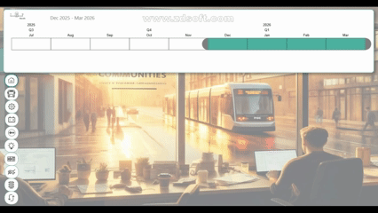

# Power BI Dashboard — Autonomous Vehicle Data

A Power BI dashboard developed at **Fondazione LINKS** for a project focused on the circulation of **autonomous shuttles for passenger transportation in Turin**.

The dashboard transforms large volumes of autonomous vehicle data into interactive and accessible insights for both technical and non-technical users. It integrates **high-frequency sensor logs (12 Hz)** stored in Parquet files, together with computed KPIs, derived indicators, and reporting aggregations.

## Dashboard Preview

## Dashboard Overview

The dashboard includes multiple analytical views covering:

* **Vehicle Dynamics** 
* **Indicators & KPIs** 
* **Fleet Overview**
* **Maps & Geospatial Data** 
* **Route & Infrastructure**

## Disclaimer

The specific project name and details regarding the original input data have been intentionally omitted. The dashboard preview is provided for demonstration purposes, with sensitive or project-specific information excluded.
